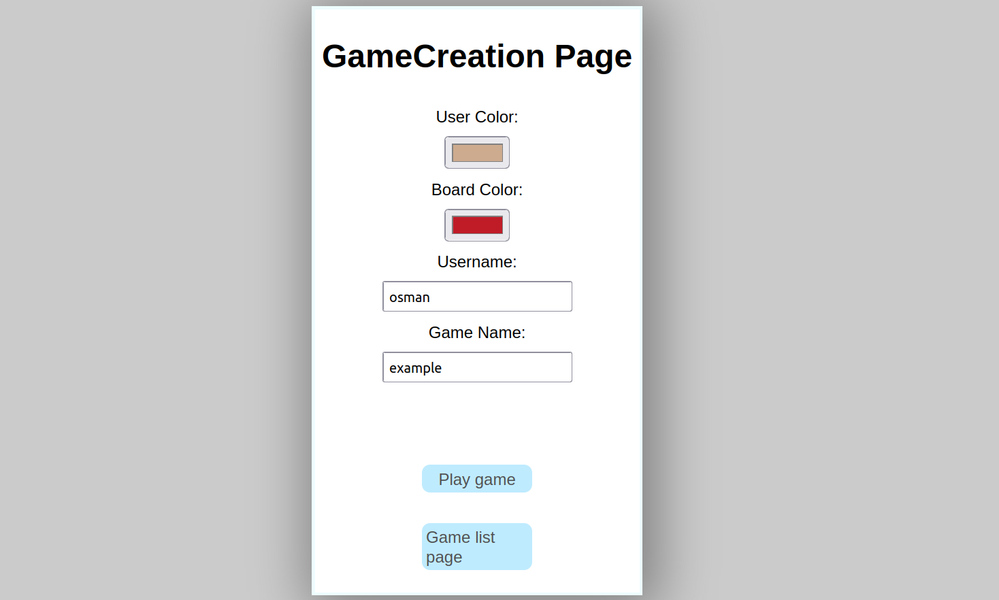
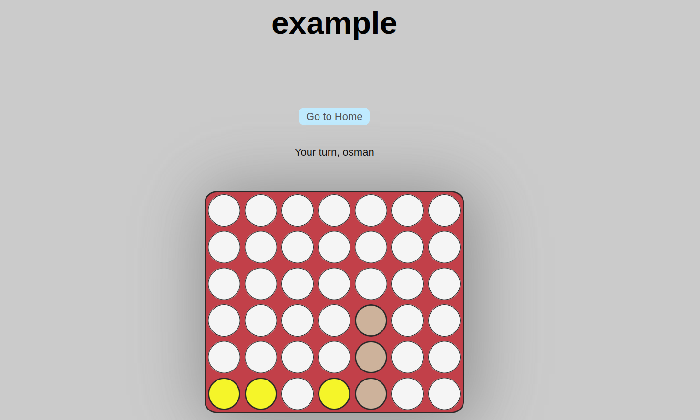
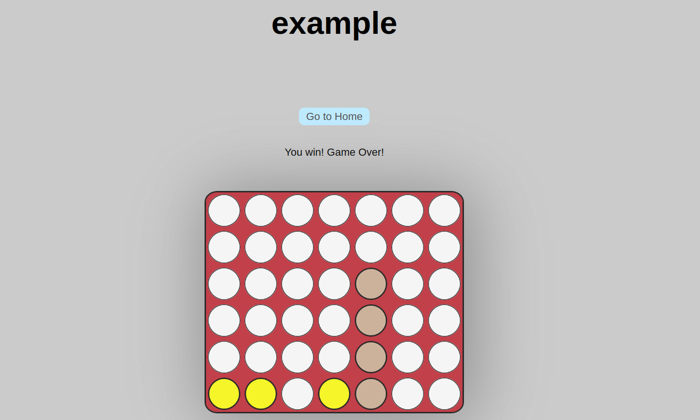
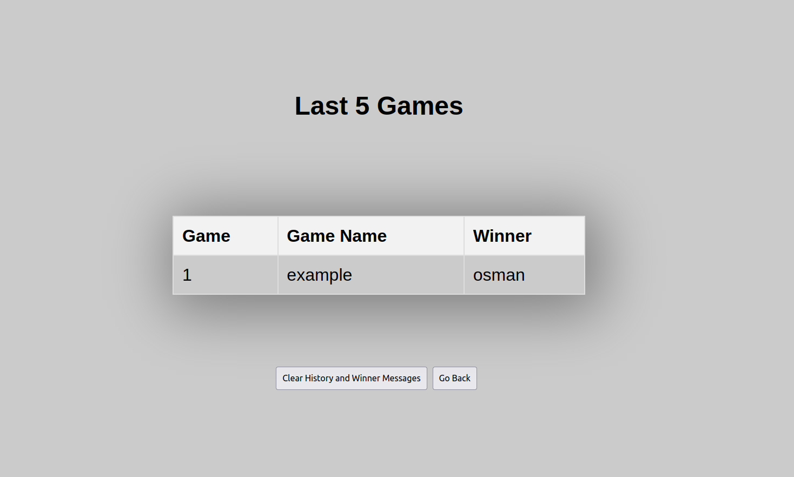

<div align="center">


An open source, connect four game<br />
playing with computer<br />
best connect four game

By the way i did this game for my education😉


---










</div>


## 📜 ⬇️ Installation guide
# How to Install - Step by Step Guide
1. Clone using the following repo link
   #### `git clone https://github.com/fullstacktutorials/install-reactjs.git my-first-project`

2. Go to the project folder and run npm install
   #### `cd my-first-project`
   #### `npm install`

3. Now run your app
   #### `npm start`

##### Note - my-first-project - you can change this with your project name.

<div><h2>for more guide ⬇️</h2></div>


<details><summary>
    <h2><code>[Click to show]</code>  ⬅️ </h2>
  </summary>


# Reactjs Installation

Reactjs can be installed by using any of the following ways:

1. npx
2. npm
3. yarn
4. create-react-app

# 1. Using NPX
- it’s a package runner tool that comes with npm 5.2+
## npx create-react-app my-first-project

# 2. Using NPM
- it is available in npm 6+
## npm init react-app my-first-project

# 3. Using Yarn 
- it is available in Yarn 0.25+
## yarn create react-app my-first-project

After installing reactjs using any of the above method
Go to the your project folder and run your react app

### cd my-first-project
### npm start

Note: my-first-project is the name of your react app/project, you can change it as per your interest/requirement.

# 4. Using create-react-app

Step-1: First, install - Create React App.

For Windows:
## npm install -g create-react-app

For Linux and Mac:
## sudo npm install -g create-react-app

Step-2: Now, create your project.
## create-react-app my-first-project

Step-3: Now, start the your app/project.
//Go to your project folder & start your app.
## cd my-first-project
## npm start


# Getting Started with Create React App

This project was bootstrapped with [Create React App](https://github.com/facebook/create-react-app).

## Available Scripts

In the project directory, you can run:

### `npm start`

Runs the app in the development mode.\
Open [http://localhost:3000](http://localhost:3000) to view it in the browser.

The page will reload if you make edits.\
You will also see any lint errors in the console.

### `npm test`

Launches the test runner in the interactive watch mode.\
See the section about [running tests](https://facebook.github.io/create-react-app/docs/running-tests) for more information.

### `npm run build`

Builds the app for production to the `build` folder.\
It correctly bundles React in production mode and optimizes the build for the best performance.

The build is minified and the filenames include the hashes.\
Your app is ready to be deployed!

See the section about [deployment](https://facebook.github.io/create-react-app/docs/deployment) for more information.

### `npm run eject`

**Note: this is a one-way operation. Once you `eject`, you can’t go back!**

If you aren’t satisfied with the build tool and configuration choices, you can `eject` at any time. This command will remove the single build dependency from your project.

Instead, it will copy all the configuration files and the transitive dependencies (webpack, Babel, ESLint, etc) right into your project so you have full control over them. All of the commands except `eject` will still work, but they will point to the copied scripts so you can tweak them. At this point you’re on your own.

You don’t have to ever use `eject`. The curated feature set is suitable for small and middle deployments, and you shouldn’t feel obligated to use this feature. However we understand that this tool wouldn’t be useful if you couldn’t customize it when you are ready for it.

## Learn More

You can learn more in the [Create React App documentation](https://facebook.github.io/create-react-app/docs/getting-started).

To learn React, check out the [React documentation](https://reactjs.org/).

### Code Splitting

This section has moved here: [https://facebook.github.io/create-react-app/docs/code-splitting](https://facebook.github.io/create-react-app/docs/code-splitting)

### Analyzing the Bundle Size

This section has moved here: [https://facebook.github.io/create-react-app/docs/analyzing-the-bundle-size](https://facebook.github.io/create-react-app/docs/analyzing-the-bundle-size)

### Making a Progressive Web App

This section has moved here: [https://facebook.github.io/create-react-app/docs/making-a-progressive-web-app](https://facebook.github.io/create-react-app/docs/making-a-progressive-web-app)

### Advanced Configuration

This section has moved here: [https://facebook.github.io/create-react-app/docs/advanced-configuration](https://facebook.github.io/create-react-app/docs/advanced-configuration)

### Deployment

This section has moved here: [https://facebook.github.io/create-react-app/docs/deployment](https://facebook.github.io/create-react-app/docs/deployment)

### `npm run build` fails to minify

This section has moved here: [https://facebook.github.io/create-react-app/docs/troubleshooting#npm-run-build-fails-to-minify](https://facebook.github.io/create-react-app/docs/troubleshooting#npm-run-build-fails-to-minify)

</details>

## 👥 The Connect Four team

- [osmangozukucuk]([https://github.com/KRTirtho](https://github.com/osmangozukucuk)) - The Founder, Maintainer and Developer

## Project Structure 
```bash
.

├── public
│   ├── anaekran.png
│   ├── favicon.ico
│   ├── index.html
│   ├── kazanma.png
│   ├── logo192.png
│   ├── logo512.png
│   ├── manifest.icon
│   ├── oyun.png
│   ├── robots.txt
│   ├── sonuc.png
│   └── ubn.png
├── src
│   ├── gamecreation
│   │   └── StartPage.js
│   ├── GameScreen
│   │   ├── ConnectFour.css
│   │   └── ConnectFour.js
│   ├── ListOfLastGames
│   │   ├── history.css
│   │   └── history.js
│   ├── App.js
│   ├── index.js
│   ├── reportWebVitals.js
│   └── setupTest.js
├── .gitignore
├── README.md
├── package-lock.json 
└── package.json
```


<details>
  <summary>
    <h2><code>[Click to show]</code>  the path I followed / and more info </h2>
  </summary>
<h3>
  <br />
  1.I asked to chatgpt to make my game screen page

  2.I explained the rules

  3.I explained the cells, colors and wanted to follow mechanics

  4.I wanted to add some functions like: tie,win,lose and asked to chatgpt to make them
  
  5.I worked on it a bit and finished it
  
  6.I asked to make transition between pages to chatgpt
  
  7.I created my game list page and game creation page
  
  8.I started to doing game creation page i used local.storage for the choosing colors and printing the names
  
  9.After finishing the game creation page i asked to the chatgpt to do saving win, lose, tie functions to local.storage
  
  10.Then started the game list page i used local.storage again
  
  11.After completing these pages i started to doing styles and i getted a lot of help from chatgpt
  
  12.and finally I wrote this documentation.
  </h3>
</details>

<div align="center"><h4>Thank you for your attention 🙏</h4></div>
